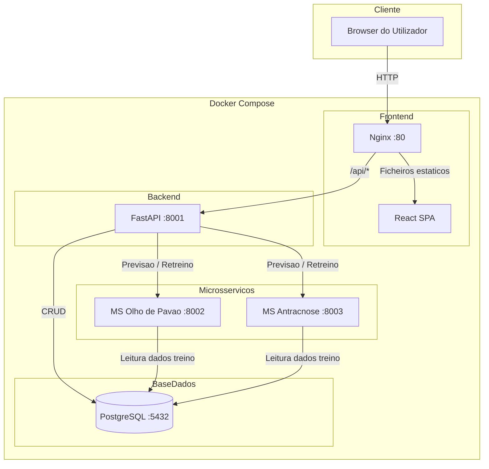
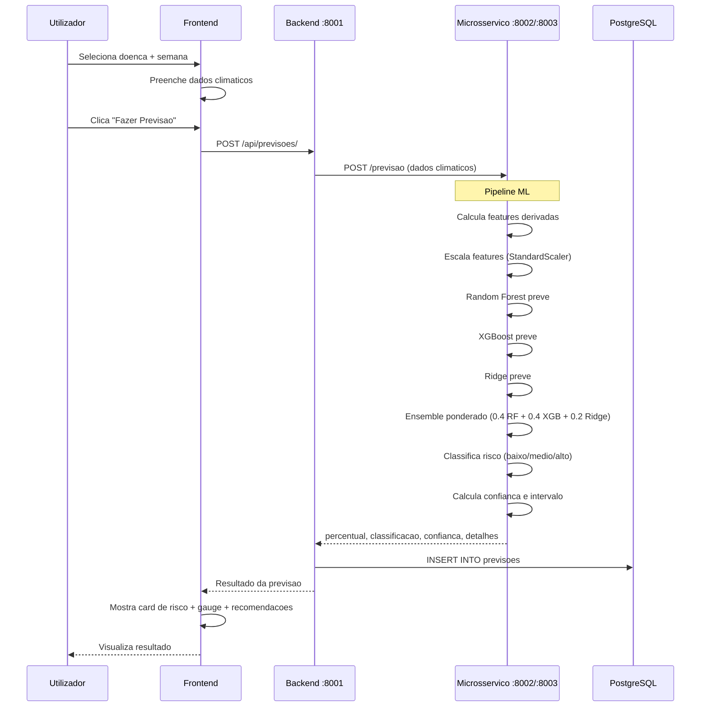
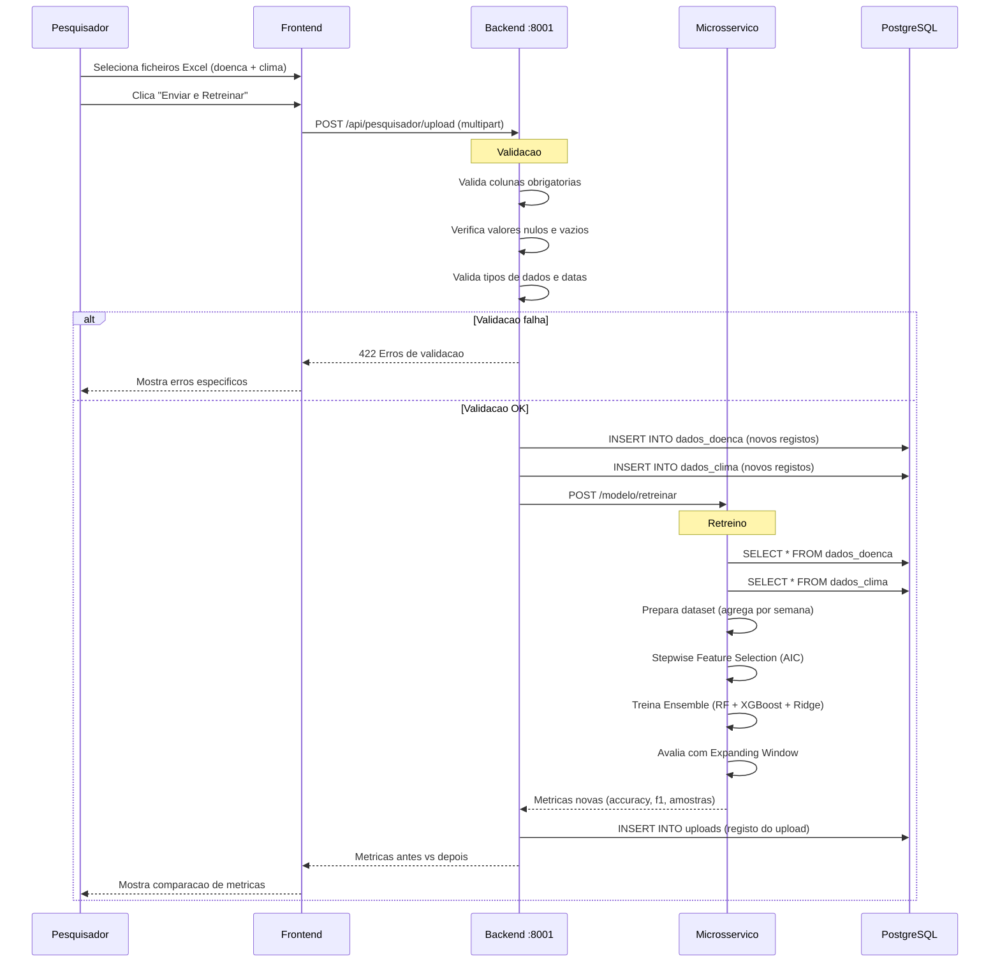
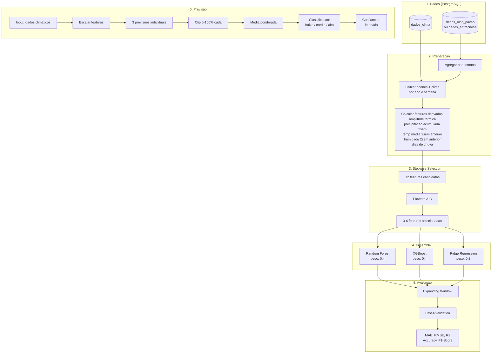
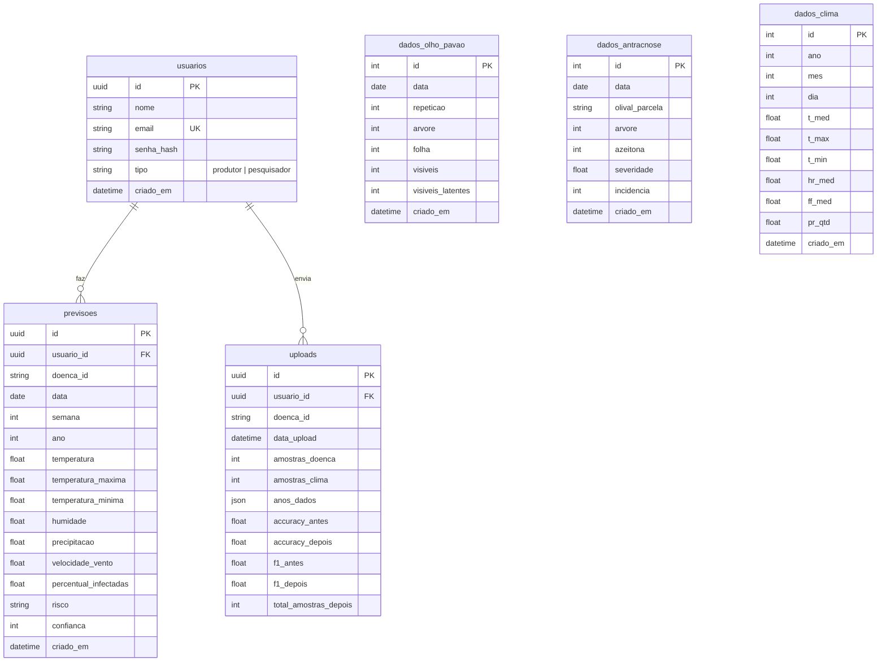
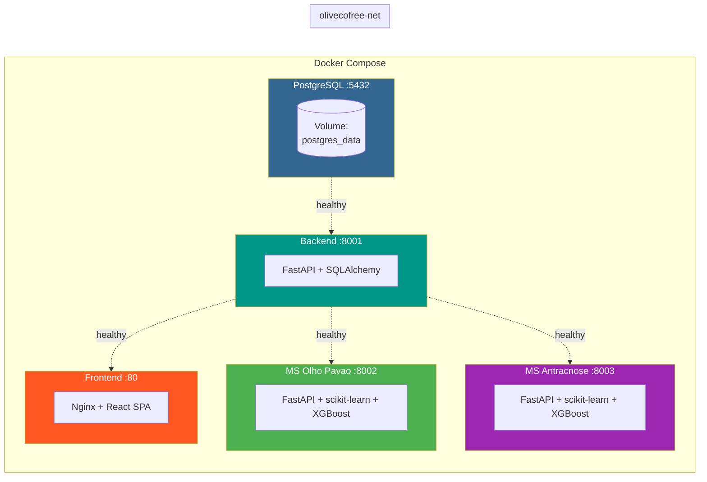
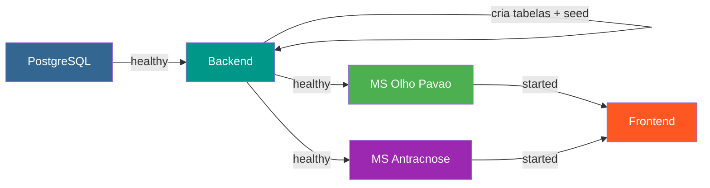

# Arquitetura OliveCoFree

## 1. Visao Geral do Sistema

## 2. Fluxo de Previsao

## 3. Fluxo de Upload e Retreino (Painel Cientifico)

## 4. Pipeline de Machine Learning

## 5. Modelo de Dados (PostgreSQL)

## 6. Infraestrutura Docker

## 7. Ordem de Startup

